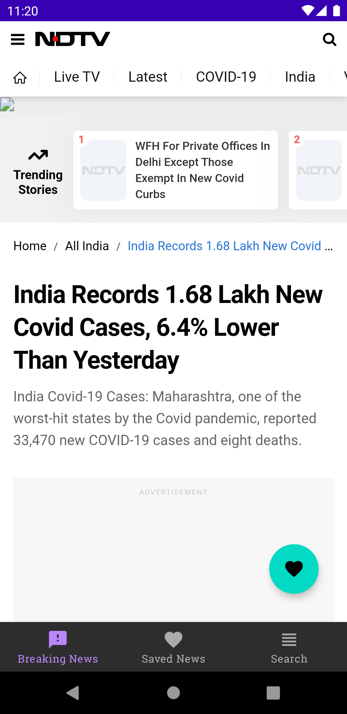
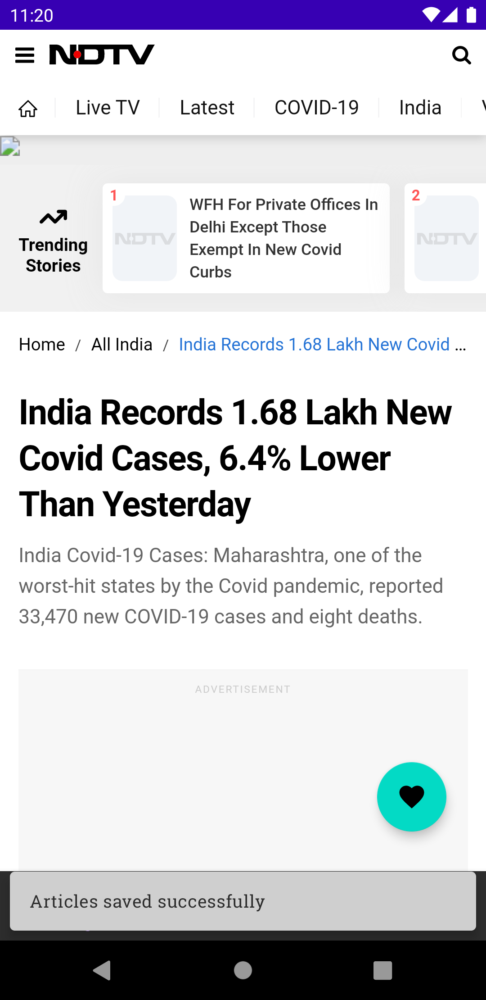
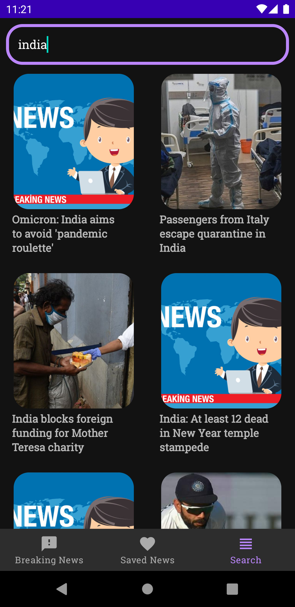

# News App

News App helps you to keep in touch with the world and helps you search for different kinds of news and save your favourite articles.

This app uses the free version of newsapi provided by newsapi.org and is based on the MVVM architecture in android. 

# Screenshots:

